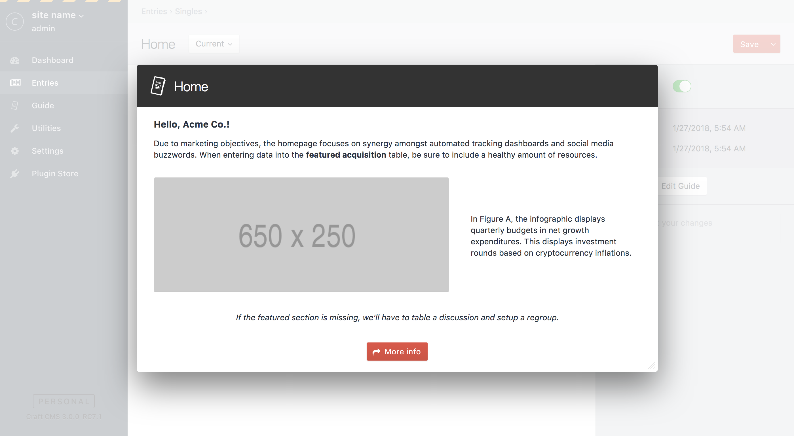
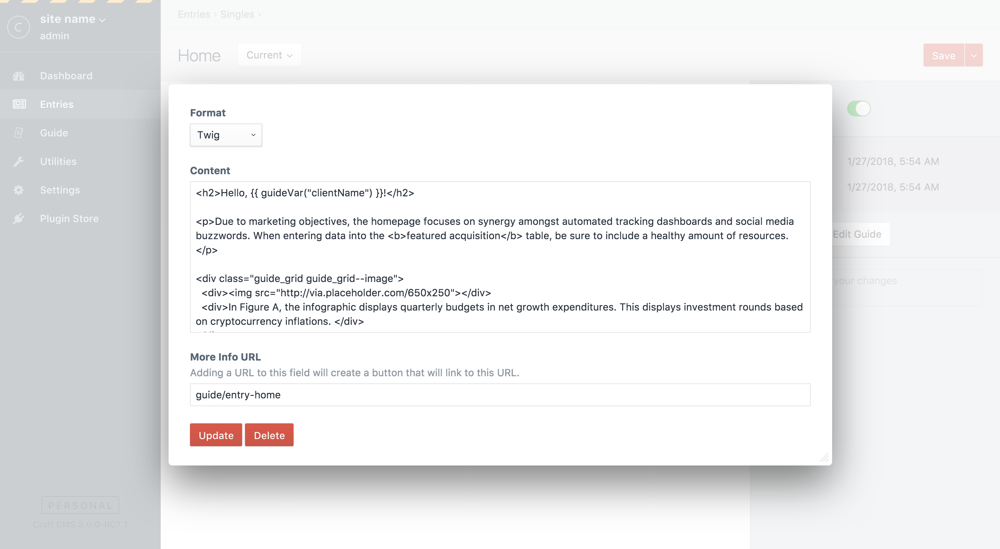
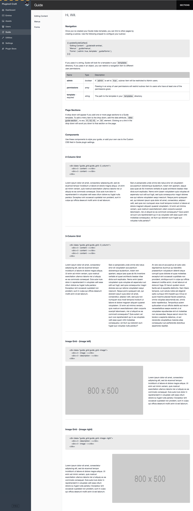

# Guide for Craft CMS 3

A CMS Guide for Craft CMS.


## Requirements

- This plugin requires Craft CMS 3.0.0-RC7 or later.
- A browser that support CSS Grid Layout and CSS Custom Properties.

## Installation

To install the plugin, you can find it in the Craft Plugin Store, or follow these instructions.

1. Open your terminal and go to your Craft project:

        cd /path/to/project

2. Then tell Composer to load the plugin:

        composer require wbrowar/guide

3. In the Control Panel, go to Settings → Plugins and click the “Install” button for Guide.

4. Use the following instructions to add guides to the Control Panel:
   - [Guide CP Section](https://github.com/wbrowar/craft-3-guide#guide-cp-section)
   - [Content Guides](https://github.com/wbrowar/craft-3-guide#content-guides)
   - [Guide Widget](https://github.com/wbrowar/craft-3-guide#guide-widget)

## Guide Overview

Craft CMS is intuitive. Marketing plans and organizational workflows—not so much. Guide lets you create a user manual within Craft CMS so clients don't need to go far to get the answers they need.

## Guide CP Section


### Guide Template

Use templates to create your CMS guide in a way that's easily portable from one site to another. Follow these instructions to create your guide within the Guide CP Section:

1. Create an index template in your site's `templates` directory. It can be named whatever you want, but the default is `_guide/index`. So if you create an `index.twig` file and placce it in the `./templates/_guide/` directory, it will show up in the Guide CP Section. 
2. If you want to change your Guide index template's location, edit the path to your new location on the Guide plugin settings page.
3. You can create multiple pages and link to them through a navigation set in your Guide index template. Configure this code anywhere within your Home template. *NOTE: this code does not need to be located on any other template.*
    
    ```$twig
    {{ updateGuideCpNav({
        'Editing Content': '_guide/edit-entries',
        'Menus': '_guide/menus',
        'Forms': { admin: true, template: '_guide/forms' },
    }) }}
    ```
    
4. Edit your templates as needed. You can use these [style components](https://github.com/wbrowar/craft-3-guide#components) to change the layout.

5. If you have several sections of content on one page, add the `data-guide-section` attribute to any `h1, h2, h3`, or `h4` to add a drop down navigation that scrolls up and down the page to each section.

6. Most of Guide's CSS relies on Craft's default Control Panel CSS, but if you need to override styles or add your own CSS, use the [Custom CSS](https://github.com/wbrowar/craft-3-guide#css-variables) field in Guide's plugin settings.

7. Once you've written your first CMS guide, you can re-use the template files in another site—swapping out specific information using [Guide Variables](https://github.com/wbrowar/craft-3-guide#guide-variables)

*NOTE: The Guide CP Nav gets updated whenever the Guide Home template is loaded. To update Guide CP Nav, just click on the Guide tab in CP.*

### Twig Extensions

Guide comes with a few helper tags that make it easier to do template logic and to bring content into your Guide CP Sectiong guides, Content Guides, and Guide Widgets.

| Variable Key | Description |
| --- | --- |
| `{{ guideAsset('FILENAME') }}` | Does a simple query for an image asset based on file name. |
| `{{ guideQuery(OBJECT) }}` | Find Content Guides based on the given criteria. For example, `{{ guideQuery({ sectionId: 1, typeId: 1 }) }}` might return the Content Guide for the Homepage section. |
| `{{ guideVar('VAR_KEY') }}` | Pull in content set in settings, see [Guide Variables](https://github.com/wbrowar/craft-3-guide#guide-variables) for more information. |
| `{{ pluginEnabled('PLUGIN_HANDLE') }}` | A boolean that checks to see if a plugin is currently installed. |

### Guide Variables

Guide provides a set of variables that can be placed in your Twig templates to make it easy to swap out project-specific information.

To display a Guide Variable in your Twig templates, you can set the value of each variable in the Guide plugin settings page, then use the `{{ guideVar() }}` Twig extension to display that value in your page templates.

For example, if you enter "Acme Co." in the **Client Name** field, you could write this into your Guide template:

```twig
<h1>Hello, {{ guideVar("clientName") }}</h1>
```

And it would output this:

```html
<h1>Hello, Acme Co.</h1>
```

Guide templates are available in all of your Twig templates, so anywher you can write Twig code, you can access the values of Guide Variables.

Here are all of the available Guide Variables;

| Variable Key | Type |
| --- | --- |
| `clientName` | string |
| `myCompanyName` | string |

## Content Guides

Say your client is already editing an entry and they want to look something up. Instead of sending them off to the Guide CP Section, you can leave instructions right on the Entry Edit page. Using action buttons in the sidebar—under Publish Options—you can create a Guide that appears on all Entry Edit pages of that entry type. The guide will appear in a modal—in front of the entry fields—so your content editor won't lose their place.



You can create the guide using Markdown, Twig, or by pointing to a template in your site's `templates` folder.



Content Guides can be collaborative, too. By changing the "Who can edit guides?" field in Guide plugin settings, clients will be able to update existing guides and create their own guides. 

## Guide Widget

A welcome message can be a good starting point for your content editors. Let them know where to begin once they've logged into the CMS by creating a Guide Widget.


This can include just a simple note written in markdown or you can use dynamic content via Twig. You can create and customize as many Guide Widgets as you'd like.


## Components

Components are slightly-styled, reusable snippets that can help you change the layout within Guide sections.

Here's a list of available components:

| Classes | Description |
| --- | --- |
| `.guide_code_block` | Call out code or other text in `div` or block element |
| `.guide_code_inline` | Highlight code or other text. |
| `.guide_grid` | Grid only enables CSS Grid Layout on it's own. If you add a modifier, you can create multiple column layouts. |
| `.guide_grid .guide_grid--2_column` | Creates a 2-column grid. |
| `.guide_grid .guide_grid--3_column` | Creates a 3-column grid. |
| `.guide_grid .guide_grid--image` | Feature an image (or content) with a large area on the left and text on the right. |
| `.guide_grid .guide_grid--image--right` | The same as `.guide_grid--image` but switched, with the large area on the right. |



## CSS Variables

Guide is color neutral by default, but some simple CSS changes can help you rebrand Guide to your liking. To make it easier than hunting down CSS selectors, you can change [CSS Custom Properties](https://developer.mozilla.org/en-US/docs/Web/CSS/--*) that drive Guide's theme.


For example, if you want to match Craft's sidebar, enter this into the Custom CSS field in Guide's plugin settings. Anywhere these properties are set they will be updated.

```css
:root {
  --guide-color-bg: rgb(51, 63, 77);
  --guide-color-link: rgb(255, 255, 255);
  --guide-color-text: rgb(187, 187, 187);
  --guide-color-h1: rgb(236, 236, 236);
}
```


Regular CSS can be used, as well. Custom CSS entered in Guide's plugin settings will appear on all pages within the CP.
 
*NOTE: Another idea could be to re-brand Guide to your own company's brand colors.*

## Guide Roadmap

Some things to do, and ideas for potential features:

- Expand theming CSS options and components
- ~~Add sub-navigation to CP Section pages~~
- Add a default template to Guide widgets for easy portability
- ~~Add the ability to create guide notes and pages within Craft CMS (stored in the DB)~~
- Expand Content Guides into Users and Categories
- Make guides in Guide CP Section collaborative
- A few more ideas are in the works

Brought to you by [Will Browar](https://twitter.com/wbrowar)
