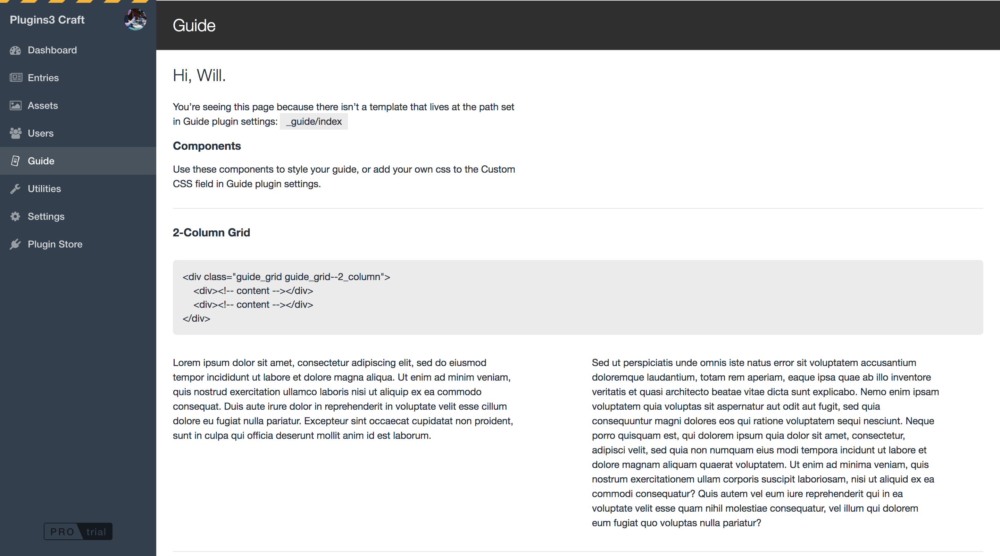
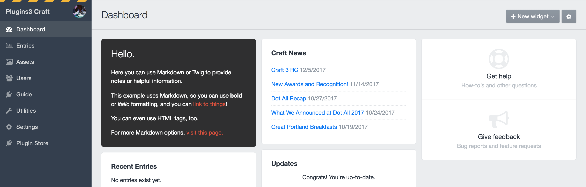
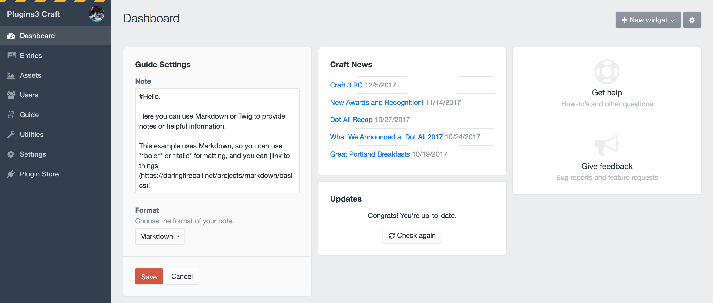
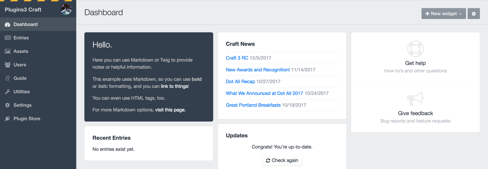
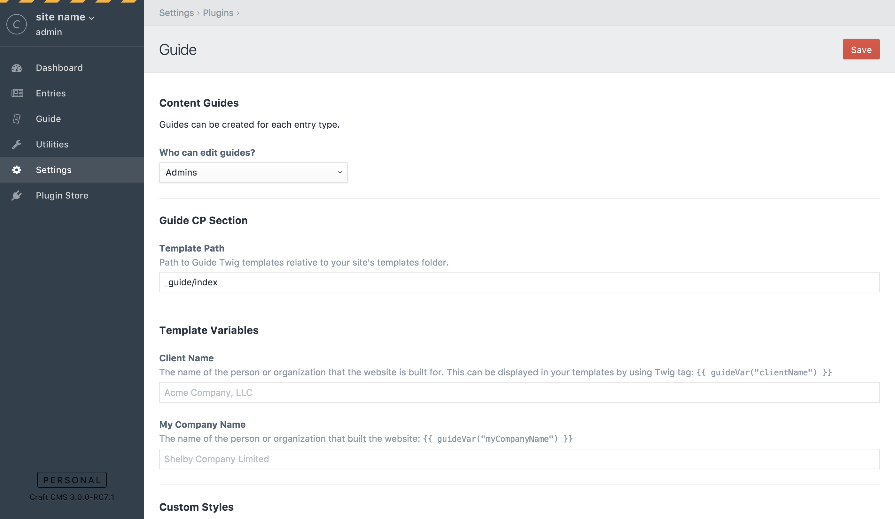

# Guide for Craft CMS 3

A CMS Guide for Craft CMS.



## Requirements

- This plugin requires Craft CMS 3.0.0-RC1 or later.
- A browser that support CSS Grid Layout.

## Installation

To install the plugin, follow these instructions.

1. Open your terminal and go to your Craft project:

        cd /path/to/project

2. Then tell Composer to load the plugin:

        composer require wbrowar/guide

3. In the Control Panel, go to Settings → Plugins and click the “Install” button for Guide.

4. Use the following instructions to add components to the Control Panel:
   - [Guide CP Section](https://github.com/wbrowar/craft-3-guide#guide-cp-section)
   - [Guide Widget](https://github.com/wbrowar/craft-3-guide#guide-widget)

## Guide Overview

Craft CMS is intuitive. Marketing plans and organizational workflows—not so much. Guide helps you explain the rules of the road right where the rules need to be read. Create your CMS Guide within a section of the Control Panel and write your own Dashboard welcome widget.

## Guide CP Section


### Guide Template

Use templates to create your CMS guide, in a way that's easily portable from one site to another. Follow these instructions to create your guide within the Guide CP Section:

1. Create an index template in your site's `templates` directory. It can be named whatever you want, but the default is `_guide/index`. So if you create an `index.twig` file at this path, `/templates/_guide/index.twig`, it will show up in the Guide CP Section. 
2. If you want to change your Guide index template's location, edit the path to your new location on the Guide plugin settings page.
3. You can create multiple pages and link to them through a navigation set in your Guide index template. Configure this code anywhere within your Home template. *NOTE: this code does not need to be located on any other template.*
    
    ```$twig
    {{ updateGuideCpNav({
        'Editing Content': '_guide/edit-entries',
        'Menus': '_guide/menus',
        'Forms': { admin: true, template: '_guide/forms' },
    }) }}
    ```
    
4. Edit your templates as needed. You can use these helper components to change the layout.

5. Most of Guide's CSS relies on Craft's default Control Panel CSS, but if you need to override styles or add your own CSS, use the Custom CSS field in Guide's plugin settings.

*NOTE: The Guide CP Nav gets updated whenever the Guide Home template is loaded. To update Guide CP Nav, just click on the Guide tab in CP.*

## Guide Widget

A welcome message can be a good starting point for your content editors. Let them know where to begin once they've logged into the CMS by creating a Guide Widget.



This can include just a simple note written in markdown or you can use dynamic content via Twig. You can create and customize as many Guide Widgets as you'd like.



## Components

Components are slightly-styled, reusable snippets that can help you change the layout within Guide notes and CP pages.

Here's a list of available components:

| Classes | Description |
| --- | --- |
| `.guide__code_block` | Call out code or other text in `div` or block element |
| `.guide__code_inline` | Highlight code or other text. |
| `.guide_grid` | Grid only enables CSS Grid Layout on it's own. If you add a modifier, you can create multiple column layouts. |
| `.guide_grid .guide_grid--2_column` | Creates a 2-column grid when the viewport is wider than 700px. |
| `.guide_grid .guide_grid--3_column` | Creates a 3-column grid when the viewport is wider than 700px. |

## CSS Variables

Guide is color neutral by default, but some simple CSS changes can help you rebrand Guide to your liking. To make it easier than hunting down CSS selectors, you can change [CSS Custom Properties](https://developer.mozilla.org/en-US/docs/Web/CSS/--*) that drive Guide's default theme.



For example, if you want to match Craft's sidebar, enter this into the Custom CSS field in Guide's plugin settings. Anywhere these colors are set they will be updated.

```$css
:root {
  --guide-color-bg: rgb(51, 63, 77);
  --guide-color-link: rgb(255, 255, 255);
  --guide-color-text: rgb(187, 187, 187);
  --guide-color-h1: rgb(236, 236, 236);
}
```



Regular CSS can be used, as well. Custom CSS entered in Guide's plugin settings will appear on all pages within the CP.
 
*NOTE: Another idea could be to rebrand Guide to your own company's brand colors.*

## Guide Roadmap

Some things to do, and ideas for potential features:

- Expand theming CSS options and components
- Add sub-navigation to CP Section pages
- Add a default template to Guide widgets for easy portability
- Add the ability to create guide notes and pages within Craft CMS (stored in the DB)
- A few more ideas are in the works

Brought to you by [Will Browar](https://twitter.com/wbrowar)
